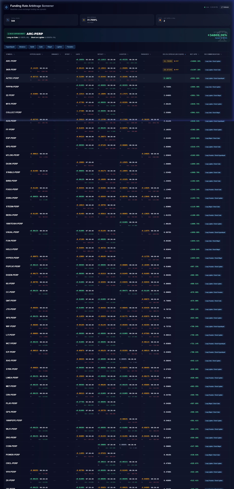

# ⚡ Funding Rate Arbitrage Screener

Real-time cross-exchange funding rate arbitrage scanner with Telegram alerts. Monitors **7 exchanges** simultaneously and identifies the best opportunities to profit from funding rate differentials.



## 🔥 Features

- **7 Exchanges** — Binance, Hyperliquid, Bybit, Gate.io, Bitget, Lighter, Paradex
- **Real-time Dashboard** — Live funding rates with auto-refresh every 30s
- **Countdown Timers** — Shows time until next funding payment per exchange
- **Telegram Bot** — Hourly Top 5 alerts to groups and private chats
- **Delta Spread** — Normalized 8h-equivalent spread calculation across different intervals (1h, 4h, 8h)
- **Annualized APR** — See projected yearly returns at a glance
- **Smart Recommendations** — Automatically suggests Long/Short legs

## 📊 How It Works

Funding rate arbitrage involves:
1. **Long** on the exchange with the lowest funding rate (you pay less)
2. **Short** on the exchange with the highest funding rate (you receive more)
3. The **spread** between the two is your profit

This tool scans all 7 exchanges, normalizes rates to 8h-equivalent, and sorts by the biggest spread opportunities.

## 🚀 Quick Start

### Prerequisites
- Node.js 18+
- npm or yarn

### Install & Run

```bash
git clone https://github.com/yourusername/arbfunding.git
cd arbfunding
npm install
npm run dev
```

Open [http://localhost:3000](http://localhost:3000)

## 🤖 Telegram Bot Setup

1. Create a bot via [@BotFather](https://t.me/BotFather) → `/newbot`
2. Set `/setjoingroups` → Enable
3. Set `/setprivacy` → Disable
4. Create `.env.local`:

```env
TELEGRAM_BOT_TOKEN=your_bot_token_here
TELEGRAM_CHAT_IDS=your_chat_id_here
CRON_SECRET=your_secret_here
```

5. Get your chat ID:
   - Add bot to your group
   - Visit `https://api.telegram.org/bot<TOKEN>/getUpdates`
   - Find `"chat":{"id":-100xxxxx}`

### Bot Commands
| Command | Description |
|---------|-------------|
| `/start` | Welcome message |
| `/top` | Top 5 opportunities right now |
| `/help` | How it works |

## ☁️ Deploy to Vercel

1. Push to GitHub
2. Import project at [vercel.com](https://vercel.com)
3. Set environment variables:
   - `TELEGRAM_BOT_TOKEN`
   - `TELEGRAM_CHAT_IDS`
   - `CRON_SECRET`
4. Deploy!
5. Set webhook:
   ```
   https://api.telegram.org/bot<TOKEN>/setWebhook?url=https://YOUR_URL/api/telegram/webhook
   ```
6. Set up hourly cron via [cron-job.org](https://cron-job.org):
   ```
   URL: https://YOUR_URL/api/cron/alert?secret=YOUR_SECRET
   Schedule: Every 1 hour
   ```

## 📡 API Endpoints

| Endpoint | Method | Description |
|----------|--------|-------------|
| `/api/arbitrage` | GET | All arbitrage data (JSON) |
| `/api/cron/alert` | GET | Trigger Telegram alert (requires `?secret=`) |
| `/api/telegram/webhook` | POST | Bot command handler |

## 🏗️ Tech Stack

- **Framework**: Next.js 16
- **UI**: React + TailwindCSS
- **Table**: @tanstack/react-table
- **Data**: SWR (auto-refresh)
- **APIs**: Direct exchange REST APIs (no API keys needed)

## 📋 Exchange Coverage

| Exchange | Type | Funding Interval | API |
|----------|------|------------------|-----|
| Binance | CEX | 1h / 4h / 8h | Public |
| Hyperliquid | DEX | 1h | Public |
| Bybit | CEX | 8h | Public |
| Gate.io | CEX | 4h / 8h | Public |
| Bitget | CEX | 8h | Public |
| Lighter | DEX | 1h | Public |
| Paradex | DEX | 1h | Public |

## ⚠️ Disclaimer

This tool is for **informational purposes only**. Funding rate arbitrage involves significant risks including but not limited to: liquidation risk, exchange risk, execution risk, and basis risk. Always do your own research and never risk more than you can afford to lose.

## 📄 License

MIT
